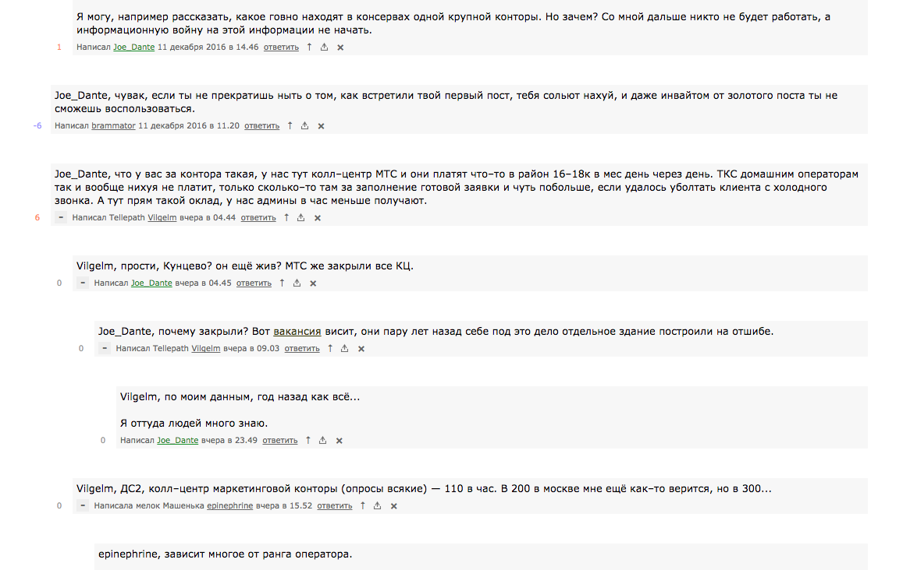

# Лепробатя

Это расширение для браузера Google Chrome, которое несколько улучшает внешний
вид лепры в браузере. Тут-и-там двигает на пару пикселей разные иконки, которые
не давали мне покоя годами. Подсвечивает автора поста, прикручивает нормальные
кнопки сворачивания и т.д.

## Установка

Мне было лень добавлять его в магазин приложений, так что если ты хочешь
поставить эту штуку, то придется сделать это вручную. Для этого нужно выполнить
три довольно простых шага:

1. Скачать содержимое этого репозитория.
2. Открыть [chrome://extensions/](chrome://extensions/) и нажать на кнопочку
   Developer mode в верхнем правом углу.
3. Нажать на кнопочку Load unpacked extension и выбрать папку с содержимым
   репозитория.

## Лицензия

Мне похуй.
